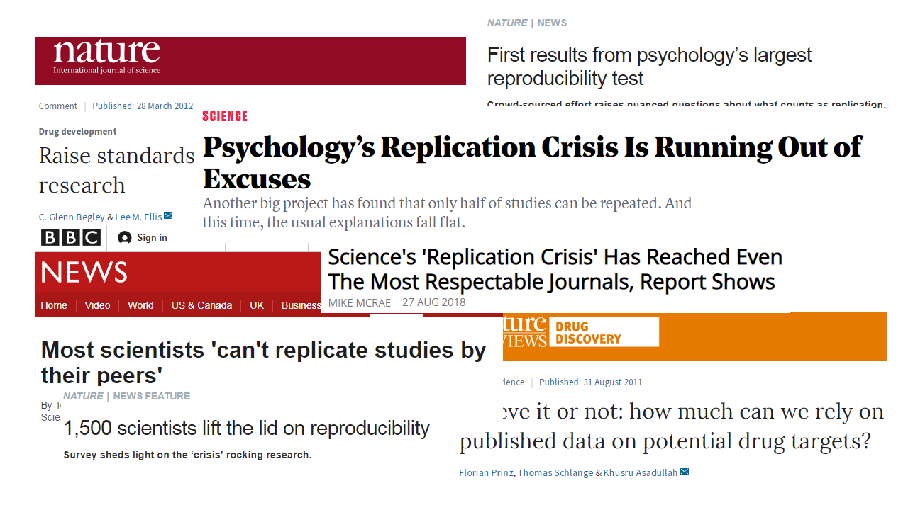
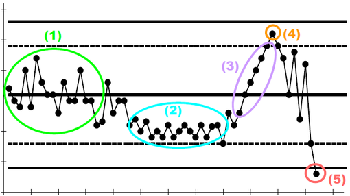
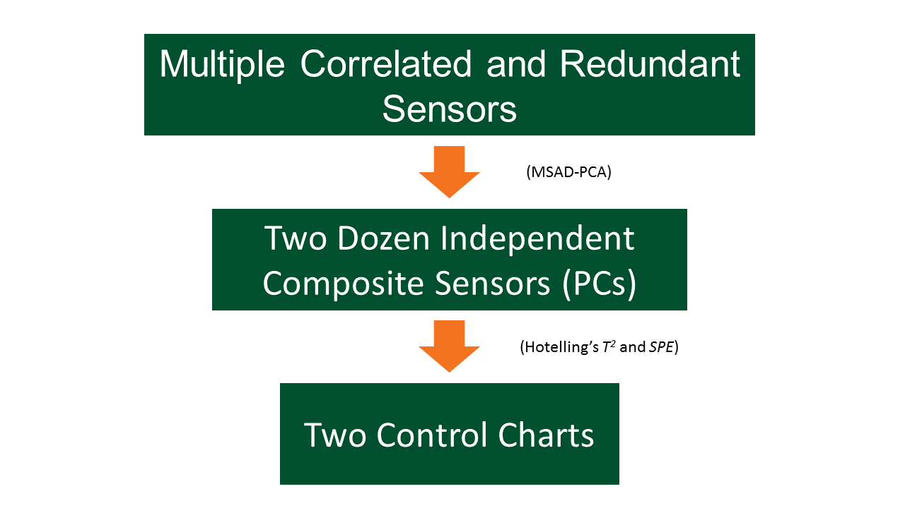
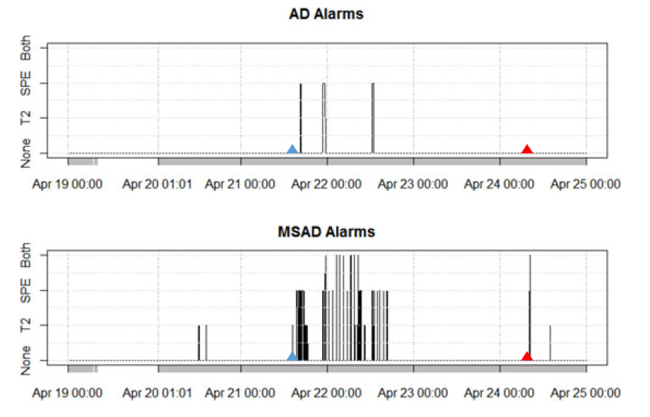
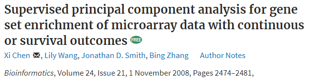
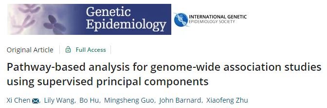
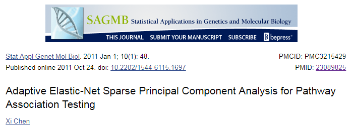
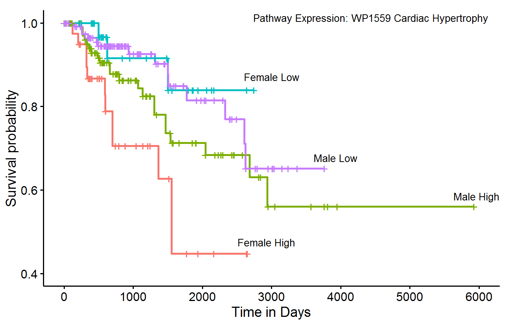
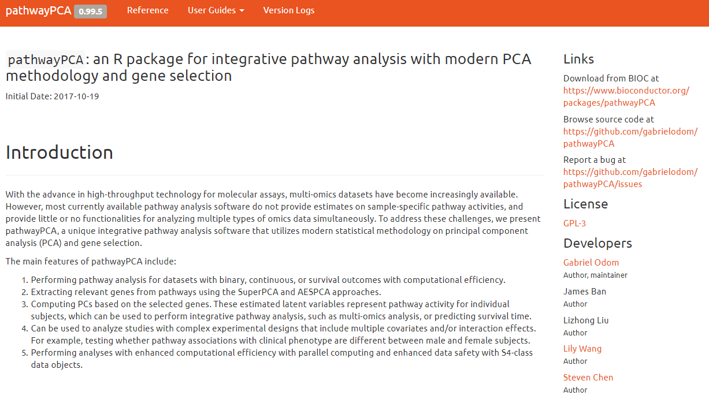
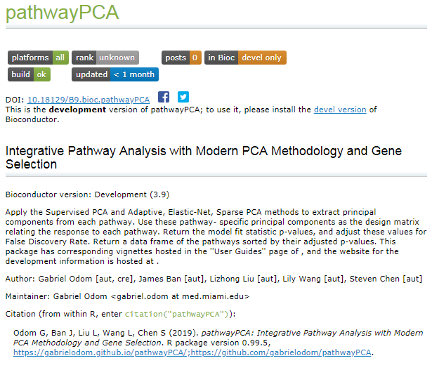

```{r setup, include=FALSE}
knitr::opts_chunk$set(echo = FALSE)
```

<!-- When I say "research", I mean "data science". Data science IS my research. -->

<!-- Adding font colour -->
<!-- <font color="#005030">write text here</font> -->

<!-- Adding lines under hyperlinks -->
<!-- border-bottom: 1px solid rgba(105, 105, 105, 0.5); -->

# Overview

## Overview

- About Me
- Reproducible Data Science and Software
- Example 1: Decentralised Water Quality Monitoring
- Example 2: Detecting Pathways that Drive Cancer
- Conclusion


<!-- ====================================================================== -->

# About Me

<!-- ## Personal Details -->

<!-- <div class="columns-2"> -->

<!--   - Born in Pensacola, FL -->
<!--   - Lived/Studied in Madison, WI; Dallas, TX; Cambridge, UK; Waco, TX; Miami, FL -->
<!--   - First started college at 10 years old (auditing) -->
<!--   - Consulting work from San Francisco to Philadelphia and everywhere in between -->
<!--   - Married (4 years), with child (4 months) -->
<!--   - Ordained Eastern-rite (Maronite) presbyter -->

<!--   <center></center> -->

<!-- </div> -->


## Academic Interests

<div class="columns-2">

### Research
- <font color="#081E3F">**High-Dimensional Statistics**</font> ($p >> n$)
- <font color="#081E3F">**Computational Statistics**</font>
- Bayesian Statistics
- Spatial Statistics
- <font color="#081E3F">**Data Science**</font>
- "Big" EHR Data

</br>


### Curiosities
- Pedagogy
- <font color="#081E3F">**Health and Science Ethics**</font>
- Leadership Development
- Health Economics
- Infectious Disease Modelling
- Apologetics and Patristics
- Film Music

</div>

Vitae: <http://rpubs.com/gabrielodom/curriculum_vitae>

GitHub: <https://github.com/gabrielodom>


## Academic Timeline 

<center>
  
</center>


## Teaching

<div class="columns-2">

### Courses Taught
- Computational Statistics
- High-Dimensional Statistics
- R for Data Science and Development
- Special Topics in Research
- Statistics for Business I & II
- Statistics for Health Sciences


### Courses I Can Teach
- Bayesian Methods
- Bayesian Theory
- Spatial Statistics
- Multivariate Statistics
- Applied Regression
- Introduction to Machine Learning

</div>


## Statistics vs Data Science

Six Divisions of "Greater" Data Science ([Donaho, 2017](https://doi.org/10.1080/10618600.2017.1384734)):

1. Data Exploration and Preparation: <font color="#081E3F">**exploratory data analysis**</font> and data cleaning
2. Data Representation and Transformation: <font color="#081E3F">**mathematical transformations**</font>, querying databases, and data formatting
3. Computing with Data: programming languages and code packaging
4. Data Modeling: <font color="#081E3F">**statistical modelling**</font> and machine learning
5. Data Visualization and Presentation: from <font color="#081E3F">**plots**</font> to interactive websites
6. Science about Data Science: <font color="#081E3F">**meta-analysis**</font> about the utility of statistical and computational tools

\* *Traditional "statistical" topics in <font color="#081E3F">**bold**</font>.*


## My Philosophy

<q> When you use something, leave it better than when you found it. </q>

-- My mother

<font color="#081E3F">**Investing** *in people* and *for people*</font> drives my work:

1. My students should be better scientists, better collaborators, and better people after my classes / mentoring
2. The PIs I collaborate with and their staff should feel that I added lasting value
3. My research should be easy for other scientists to <font color="#081E3F">**replicate and build upon**</font>

<!-- "Ask not what science can do for you, but what you can do for science." -->


<!-- ====================================================================== -->

# Reproducible Data Science and Software

## {.fullslide}

<center>
  
</center>


## The Reproducibility Crisis

Published bio-science is largely not reproducible:

- Oncology: 53 published articles tested, six successes (<font color="#081E3F">**11%**</font>) ([Nature, 2012](https://www.nature.com/articles/483531a))
- Psychology:
    + 100 published articles, <font color="#081E3F">**39**</font> successes ([Nature News, 2015](https://www.nature.com/news/first-results-from-psychology-s-largest-reproducibility-test-1.17433))
    + 71 published articles tested, 92 replication attempts, 35 successes (<font color="#081E3F">**38%**</font>). The [PsychFileDrawer](http://www.psychfiledrawer.org/view_article_list.php) project is ongoing.
- Pharmacology: 67 published models tested, 14 successes (<font color="#081E3F">**21%**</font>) ([Nature Reviews, 2011](https://www.nature.com/articles/nrd3439-c1))


## The Reproducibility Crisis

Published bio-science is largely not reproducible:

- Oncology: 53 published articles tested, six successes (<font color="#081E3F">**11%**</font>) ([Nature, 2012](https://www.nature.com/articles/483531a))
- Psychology:
    + 100 published articles, <font color="#081E3F">**39**</font> successes ([Nature News, 2015](https://www.nature.com/news/first-results-from-psychology-s-largest-reproducibility-test-1.17433))
    + 71 published articles tested, 92 replication attempts, 35 successes (<font color="#081E3F">**38%**</font>). The [PsychFileDrawer](http://www.psychfiledrawer.org/view_article_list.php) project is ongoing.
- Pharmacology: 67 published models tested, 14 successes (<font color="#081E3F">**21%**</font>) ([Nature Reviews, 2011](https://www.nature.com/articles/nrd3439-c1))

<font color="#005030">
  **Reproducibility: if we repeat a study, the repetition should agree with the original results, or---at minimum---not refute the study's conclusions.**
</font>


## The Ioannidis crusade

[John Ioannidis](https://www.medscape.com/viewarticle/898405), physician scientist, speaks harshly against the lack of replicability in science:

- ["Replication validity of genetic association studies"](https://doi.org/10.1038/ng749) (2001)
- ["Contradicted and Initially Stronger Effects in Highly Cited Clinical Research"](https://doi.org/10.1001/jama.294.2.218) (2005)
- ["Why Most Published Research Findings Are False"](https://doi.org/10.1371/journal.pmed.0020124) (2005)
- ["Why Most Clinical Research Is Not Useful"](https://doi.org/10.1371/journal.pmed.1002049) (2016)
    

## Reproducible Data Science

<q>  Before reproducibility must come preproducibility. </q>

"Instead of arguing about whether results hold up, let’s push to provide enough information for others to repeat the experiments ... In computational science, ‘reproducible’ often means that <font color="#081E3F">**enough information is provided to allow a dedicated reader to repeat the calculations**</font> in the paper for herself." 

-- [Philip B. Stark, Professor of Statistics, UC Berkeley](https://www.nature.com/articles/d41586-018-05256-0)


## Forensic Bioinformatics

[Baggerly and Coombes (2009)](https://projecteuclid.org/download/pdfview_1/euclid.aoas/1267453942) founded the field of Forensic Bioinformatics. They wrote this paper while waging war against fabricated data:

- Dr. Potti's falsified research had made it to the clinical trial phase before it was stopped.
- Dr. Potti was found to have "engaged in research misconduct by including <font color="#081E3F">**false research data**</font>".
- He was <font color="#081E3F">**fired**</font> from the Duke University School of Medicine.
- Links: Dr. Baggerly's slides on [their process](https://www.slideshare.net/ivanoransky/baggerly-presentation-from-cse); HHS Office of Research Integrity [statement on Anil Potti](https://ori.hhs.gov/case-summary-potti-anil); *Fostering Integrity in Research*, [Appedindix D](https://www.ncbi.nlm.nih.gov/books/NBK475955/)

Potti's mistakes could have been corrected---<font color="#081E3F">**or avoided entirely**</font>---if his team had built a software package to document their data science.


## Software Packages

<font color="#005030">
  **Software Package: a self-contained suite of programs necessary to accomplish a set of related tasks.**
</font>

- <font color="#081E3F">**Functions and scripts**</font> written in one or more programming languages
- <font color="#081E3F">**Example data**</font>
- Code and data <font color="#081E3F">**documentation**</font>
- <font color="#081E3F">**Metadata**</font> about the package development process, team, and timeline
- A <font color="#081E3F">**users' guide**</font> interweaving motivation, documentation, code, output, and analysis, known as a *vignette*

Software packages for a published paper document and organize the code necessary to replicate <font color="#081E3F">**every aspect of the data analysis**</font> shown in the paper.


## Why Packages

<!-- <q>  If you write a paper without software, that paper doesn't exist. </q> -->

<!-- -- [Jeff Leek, Professor of Biostatistics, Johns Hopkins](https://simplystatistics.org/2013/01/23/statisticians-and-computer-scientists-if-there-is-no-code-there-is-no-paper/) -->
Software packages:

1. make your entire paper <font color="#081E3F">**reproducible**</font>, 
2. make your research process <font color="#081E3F">**ethical** and **transparent**</font>,
3. follow the spirit of the *Literate Programming* principle ([Knuth, 1984](http://www.literateprogramming.com/knuthweb.pdf)), and
4. enable the next generation of scientists to "stand on your shoulders".


## Why Packages

Software packages:

1. make your entire paper <font color="#081E3F">**reproducible**</font>, 
2. make your research process <font color="#081E3F">**ethical** and **transparent**</font>,
3. follow the spirit of the *Literate Programming* principle ([Knuth, 1984](http://www.literateprogramming.com/knuthweb.pdf)), and
4. enable the next generation of scientists to "stand on your shoulders".

<font color="#005030">
  **Reproducible Data Science is publishing the software package necessary to transmute our raw data into our published results.**
</font>


<!-- ====================================================================== -->

# Example 1: Monitoring Water Quality with `mvMonitoring`

## Motivating Example

- Water conservation is a growing concern around the world (and currently in the western U.S.)
- Lack of sanitation affects 35% of the world's population (65% of East Asia, 33% South Asia, 31% Sub-Saharan Africa) ([CDC, 2016](https://www.cdc.gov/healthywater/global/wash_statistics.html); [WHO, 2008](https://apps.who.int/iris/bitstream/handle/10665/43840/9789241596435_eng.pdf;jsessionid=795849054262D5644BC4D4EFC190972B?sequence=1)):
    + Over <font color="#081E3F">**1900 children die each day**</font> due to sanitation-preventable diarrheal diseases
    + "Almost <font color="#081E3F">**one tenth of the global disease burden**</font> could be prevented by improving
water supply, sanitation, hygiene and management of water resources"
    + Communities without sanitation are less likely to provide education to female students after puberty
- Decentralized wastewater reclaimation is a modern strategy to provide access to potable water and curb water waste 


## Decentralized Water Treatment
- Most global communities do not have the <font color="#081E3F">**infrastructure**</font> for centralized wastewater treatment or reclaimation
- Decentralized wastewater treatment processes are cheaper to build and maintain, and require <font color="#081E3F">**minimal human interaction**</font>
- Decentralized treatment requires sophisticated <font color="#081E3F">**automatic process monitoring**</font>
- These processes:
    1. are <font color="#081E3F">**adaptive**</font> (exhibiting change over weeks, months, and years relative to the local population),
    2. are <font color="#081E3F">**dynamic**</font> (exhibiting strong temporal dependence),
    3. have <font color="#081E3F">**multiple steady-states**</font>, and
    4. use multiple redundant and <font color="#081E3F">**highly-correlated sensors**</font> (features)


## Example Problem

- We care about monitoring the state of the system to ensure that the water <font color="#081E3F">**quality stays within proper limits**</font> and that the system does not collapse.
- A *sequencing-batch membrane bioreactor* is a tightly-controlled <font color="#081E3F">**hybrid bio-mechanical**</font> purification system.
- The internal biological ecosystem is <font color="#081E3F">**very sensitive**</font>; if it crashes, the entire treatment facility can be inoperable for *months*
- One such bio-system crash shut down a decentralized plant for *four months*

## Control Charts

Control charts detect when dynamic processes violate <font color="#081E3F">**normal operating conditions**</font> ([Shewhart, 1926](https://ieeexplore.ieee.org/abstract/document/6768099)). Example (toy data):


<center>
  
</center>

We created a new control chart that addresses the four process-monitoring concerns listed previously.


## Multi-state, Adaptive, Dynamic PCA

Control charts monitor independent, univariate sensors. We need to monitor <font color="#081E3F">**many dependent sensors simultaneously**</font>. We need PCA (*principal components analysis*) to:

- extract <font color="#081E3F">**independent composite features**</font> (orthogonal linear combinations) from the original sensors, and
- explain the <font color="#081E3F">**most information with fewest features**</font>.
- **Benefits**:
    + reduced number of charts to monitor
    + charts are now independent (under mild assumptions)
    + account for correlated sensors.
    
Multi-state, Adaptive, Dynamic PCA combines the following three algorithmic components: Dynamic PCA, Adaptive PCA, and Multi-state PCA.


## PCA Formulation

- Let $\textbf{X} \in \mathbb{R}_{(N - \ell) \times p}$ be the observed process data (including up to $\ell$ previous time points as predictors).
- Let $\textbf{P}_d \in \mathbb{R}_{p \times d}$, for $d < p$, be the projection matrix of the $d$ eigenvectors corresponding to the largest $d$ eigenvalues of $\textbf{X}$.
- The principal components matrix, $\textbf{Y} = \textbf{X}\textbf{P}_d \in \mathbb{R}_{(N - \ell) \times d}$, is the transformation of the original $p$ features into the $d$-dimensional orthogonal subspace that preserves the most information.
- Multi-state, adaptive PCA estimates a different $\textbf{P}_d$ for each state and updates these estimates regularly.
- Instead of monitoring a new observation $\textbf{x}_{\text{new}}$, we monitor $\textbf{y}_{\text{new}} = \textbf{x}_{\text{new}}\textbf{P}_d$.


## Adaptive and Dynamic PCA

### Dynamic PCA

- Include any relevant sensor data from <font color="#081E3F">**previous time points**</font>
- **Benefits**: how much water people used at 6PM yesterday is a great predictor for how much they will use at 6PM today

### Adaptive PCA

- <font color="#081E3F">**Update the projection**</font> at fixed times:
    + each hour, day, week, etc., "learn" the most recent observations and "forget" the oldest observations
    + re-estimate the principal components for the next time period.
- **Benefits**: account for the fact that people and communities change unpredictably over time


## Multi-state PCA

- Different steps in water-treatment process $\Longrightarrow$ different relationships between correlated sensors
- Estimate the principal components for <font color="#081E3F">**each state in the process**</font> independently
- **Benefits**: within-state variance is smaller than between-state variance

<!-- Washing machine example: imagine a sensor in a washing machine. The sensor will record different values across the cleaning cycle (wash, rinse, spin), but also based on the user input (delicate, whites and towels, regular). -->


## Monitoring Statistics: Hotelling's $T^2$

Hotelling's $T^2 = \textbf{y}_{\text{new}} \Lambda^{-1}_d \textbf{y}^T_{\text{new}}$, where $\textbf{y}_{\text{new}}$ is a new observation to check, and $\Lambda_d$ is the diagonal matrix of the first $d$ eigenvalues (variances).

- $T^2$ is the Mahalanobis distance of the mapped value $\textbf{y}_{\text{new}}$ from the original $p$-space into the $d$-dimensional PCA subspace.
- $T^2$ measures <font color="#081E3F">**deviations from expectation**</font> in the lower subspace.

## Monitoring Statistics: Squared Prediction Error

First, let $\textbf{e}_{\text{new}} := \textbf{x}_{\text{new}} - \textbf{y}_{\text{new}}\textbf{P}^T_d$. Then, *SPE* $= \textbf{e}_{\text{new}}\textbf{e}_{\text{new}}^T$.

- *SPE* is the squared distance between the original sensor vector and reduced-dimension approximation of this vector.
- *SPE* measures the <font color="#081E3F">**goodness-of-fit**</font> of the $d$-dimensional model.


## {.fullslide}

<center>
  
</center>


## Performance

<center>
  
</center>


## Publication
<center>
  <a href="https://doi.org/10.1002/asmb.2333">
    
  </a>
</center>

<center>
  <a href="https://gabrielodom.github.io/mvMonitoring/index.html">
    
  </a>
</center>


## Study Replication

- Our code and examples are available at <https://gabrielodom.github.io/mvMonitoring/index.html>
- The simulation study and data analysis are completely documented and repeatable through the users' guide on this page.
- This method and corresponding software are currently in use at the Mines Park Decentralized Wastewater Treatment facility in Golden, CO.
- This project is part of a pilot program for "sustainable clean water and sanitation".


<!-- ====================================================================== -->

# Example 2: Interrogating Biological Pathways with `pathwayPCA`

## Motivation

- Each year, 18 Million new cancer cases are diagnosed, and nearly <font color="#081E3F">**10 Million people die**</font> from cancer ([WHO, 2018](https://www.who.int/cancer/PRGlobocanFinal.pdf))
- A person dies of cancer every <font color="#081E3F"> **3.3 seconds**</font>.
- Cancer is the second leading cause of death in the US ([CDC, 2017](https://www.cdc.gov/nchs/products/databriefs/db328.htm))
- Different cancers cause disparities in mortality for ([NCI, 2019](https://www.cancer.gov/about-cancer/understanding/disparities)):
    + women
    + minorities
    + the indegent
    + the elderly
- Mortality is affected by society, but incidence is <font color="#081E3F">**driven by genetics**</font>


## Genetics and Cancer
- The Central Dogma of molecular biology states that <font color="#081E3F">**DNA**</font> (genes) encode <font color="#081E3F">**RNA**</font>, RNA encode <font color="#081E3F">**proteins**</font>, and proteins govern the <font color="#081E3F">**behavior of the cell**</font> (thereby governing the tissue) ([Clancy et al., 2008](https://www.nature.com/scitable/topicpage/translation-dna-to-mrna-to-protein-393))
- Cancers are primarily caused by <font color="#081E3F">**multiple mutations**</font> in genes (Knudson hypothesis) belonging to certain biological processes, such as apoptosis (programmed cell death) or proliferation ([ACS, 2014](https://www.cancer.org/cancer/cancer-causes/genetics/genes-and-cancer/gene-changes.html))
- Many cancers are caused by <font color="#081E3F">**multiple mutations of multiple genes**</font>, all working in concert to advance the disease state ([Sugimura et al., 1992](https://www.ncbi.nlm.nih.gov/pmc/articles/PMC1519606/))


## Challenges

While discovering single-gene cancer drivers is important, such as TP53 ([NCBI, 2011](https://www.ncbi.nlm.nih.gov/books/NBK22268/)), this approach has a few challenges:

- Cancers are often caused by concurrent abnormalities in <font color="#081E3F">**multiple genes**</font>
- Gene knockdown experiments only test for <font color="#081E3F">**single genes**</font>, not multiple genes
- Drug trials often find <font color="#081E3F">**redundancy**</font> in cancer-driving genes
- Single-gene testing of 20,000 genes has very <font color="#081E3F">**low statistical power**</font> after controlling for the false discovery rate

## Solutions
To overcome these challenges:

1. Group genes by their <font color="#081E3F">**biological pathways**</font> ([NIH NHGRI, 2015](https://www.genome.gov/27530687/biological-pathways-fact-sheet/)).
    + Depending on the grouping, there are anywhere from 50-5000 pathways to consider.
    + In cancer research, we usually care about
        - The C2 Canonical Pathways collection ([Broad Institute](http://software.broadinstitute.org/gsea/msigdb/genesets.jsp?collection=C2)) in the Molecular Signatures Database (1,329 pathways), or
        - The WikiPathways collection (approximately 500 pathways) ([Slenter et al., 2018](https://doi.org/10.1093/nar/gkx1064)).
2. For each of the pathways selected, test a <font color="#081E3F">**summary of the pathway**</font> for the presesence of a statistically-significant relationship with some outcome (survival time, tumor size, or cancer subtype)


## Methods to Summarize Pathways

<center>
  <a href="https://doi.org/10.1093/bioinformatics/btn458">
    
  </a>
</center>

<center>
  <a href="https://doi.org/10.1002/gepi.20532">
    
  </a>
</center>

<center>
  <a href="https://www.ncbi.nlm.nih.gov/pmc/articles/PMC3215429">
    
  </a>
</center>


## SuperPCA
<!-- Let $\textbf{X}_i \in \mathbb{R}_{n \times p_i}$ be the expression matrix for features in pathway $i$. -->

Supervised PCA (SuperPCA; [Chen et al., 2008](https://doi.org/10.1093/bioinformatics/btn458); [Chen et al., 2010](https://doi.org/10.1002/gepi.20532)):

- ranks each feature in pathway $i$ by its univariate relationship with the outcome of interest (survival time, tumor size, cancer subtype, etc.), then
- extracts principal components from the <font color="#081E3F">**most relevant features**</font>


## AES-PCA
Adaptive, Elastic-net, Sparse PCA (AES-PCA; [Chen, 2011](https://www.ncbi.nlm.nih.gov/pmc/articles/PMC3215429)) combines into a single objective function the following methods:

- <font color="#081E3F">**Elastic-Net**</font> ([Zou and Hastie, 2005](https://doi.org/10.1111/j.1467-9868.2005.00503.x))
- <font color="#081E3F">**Adaptive Lasso**</font> ([Zou, 2012](https://doi.org/10.1198/016214506000000735))
- <font color="#081E3F">**Sparse PCA**</font> ([Zou, Hastie, and Tibshirani, 2012](https://doi.org/10.1198/106186006X113430))

AES-PCA extracts principal components from pathway $i$ which minimize this composite objective function


## Pathway Associations with Cancer Survival

- Many cancers have pronounced <font color="#081E3F">**survival disparities to gender**</font> ([Dorak and Karpuzoglu, 2012](https://doi.org/10.3389/fgene.2012.00268))
- Renal cancers have a known gender effect ([ACS, 2017](https://www.cancer.org/cancer/kidney-cancer/causes-risks-prevention/risk-factors.html))
- We found a potential association between survival outcomes and the <font color="#081E3F">**interaction of gender and the first principal component**</font> of pathway WP1559.
- This pathway measures transcription factors related to *cardiac hypertrophy* (thickening of the heart muscle).
- A recent paper in *Cardiorenal Medicine* shows a strong relationship between kidney diseases and cardiac hypertrophy ([De Lullo et al., 2015](https://doi.org/10.1159/000435838)).
- Our Cox Proportional Hazards model was

$$
h(t) = h_0(t)\exp\left[\beta_1\text{PC}_1 + \beta_2\text{male} + \beta_3(\text{PC}_1\times\text{male})\right]
$$


## Kidney Cancer Survival

<center>
  <a href="https://gabrielodom.github.io/pathwayPCA/articles/Introduction_to_pathwayPCA.html#survival-curves-by-sex-interaction">
    
  </a>
</center>


## Execution

<center>
  <a href="https://gabrielodom.github.io/pathwayPCA/">
    
  </a>
</center>


## {.fullslide}

<center>
  <a href="https://doi.org/10.18129/B9.bioc.pathwayPCA">
    
  </a>
</center>


<!-- ====================================================================== -->

# Conclusion

## Review

- Published research in biomedical and social sciences is <font color="#081E3F">**largely irreproducible**</font>.
- <font color="#081E3F">**Lack of documentation**</font> during the data cleaning, visualizing, modelling, and analyzing steps is partly to blame.
- When you publish methodological or data analytical research, <font color="#081E3F">**build a software package**</font> to share your code, data, and reports.
- Software packages are valuable, self-contained, research apparatuses that greatly increase the chance that your <font color="#081E3F">**published research is replicable**</font> by the scientific community.


<!-- <font color="#000000">Be a good steward of your science!</font>  -->


## Next Steps

Tools for reproducible data science, bioinformatics, and biostatistics I am currently collaborating on or recently completed:

- `Moonlight`: A multi-omics tool to interpret pathways and indict cancer-driver genes (with Antonio Colaprico, Steven Chen, et al.).
- `coMethDMR`: An unsupervised approach for identifying differentially-methylated regions in epigenome-wide association studies (with Lissette Gomez & Lily Wang).
- `DMRcompare`: An evaluation of supervised methods for identifying differentially-methylated regions in Illumina methylation arrays (with Saurav Mallik, Lily Wang, & Steven Chen).
- `regionPredictR`: Predict clinical outcomes using CpGs from differentially-methylated regions of the genome (with Lizhong Liu & Lily Wang).
- `rnaEditR`: An unsupervised approach to cluster regions of co-edited RNA (with Jenny Zhang & Lily Wang).

<!-- - `hldr`: Supervised classification tools using linear dimension reduction for heteroskedastic data (with Ben Barnard and Dean Young). -->


## Acknowledgements

- **Chen and Wang Translational Bio Lab**: Steven Chen, Lily Wang, Lizhong Liu, Antonio Colaprico, James Ban, Jenny Zhang, Zhen Gao, Lissette Gomez, and Shirley Sun
    + NIH / NCI R01 CA158472; NIH/NCI R01 CA200987; NIH/NCI U24 CA210954
- **Hering and Cath Engineering Lab**: Amanda Hering, Tzahi Cath, Kate Newhart, Ben Barnard, Karen Kazor, and Melissa Johnson
    + NSF 1632227; KAUST OSR-2015-CRG4-2582
- **My mentors**: Dean Young, Amanda Hering, James Stamey, Steven Chen, and Lily Wang


## {.flexbox .vcenter}

<div class = "centered">

  <font size = "20">
  Thank You!
  
  Questions?
  </font>

</div>

